# Basic Pentesting

| Field       | Info                                                                 |
|-------------|----------------------------------------------------------------------|
| Platform    | [TryHackMe](https://tryhackme.com/room/basicpentestingjt)           |
| Difficulty  | Easy                                                                 |
| Category    | Web                                                                  |
| Date        | 08/07/2026                                                           |
| Time spent  | ~50 minutes                                                          |

---

## Challenge Description

A Linux machine running web and SMB services. The goal is to gain full access to the system starting from scratch — no credentials, no prior information.

---

## Process

### 1. Reconnaissance — nmap

The first step is to identify what services are running on the target machine.

```bash
nmap -sV 10.113.160.107
```

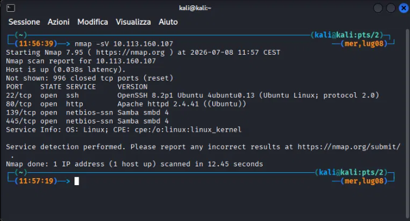

Open ports found:

| Port | Service |
|------|---------|
| 22   | SSH (OpenSSH 8.2p1) |
| 80   | HTTP (Apache 2.4.41) |
| 139  | SMB (Samba 4) |
| 445  | SMB (Samba 4) |

Two attack surfaces stand out: the web server (port 80) and SMB (ports 139/445).

---

### 2. Web Enumeration — gobuster

With Apache running on port 80, I enumerate directories.

```bash
gobuster dir -u http://10.113.160.107 -w /usr/share/wordlists/dirbuster/directory-list-2.3-small.txt
```

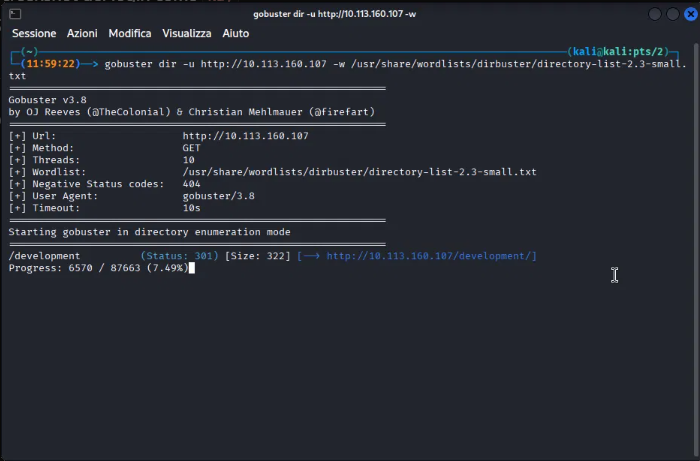

Gobuster finds `/development/`. I open it in the browser.

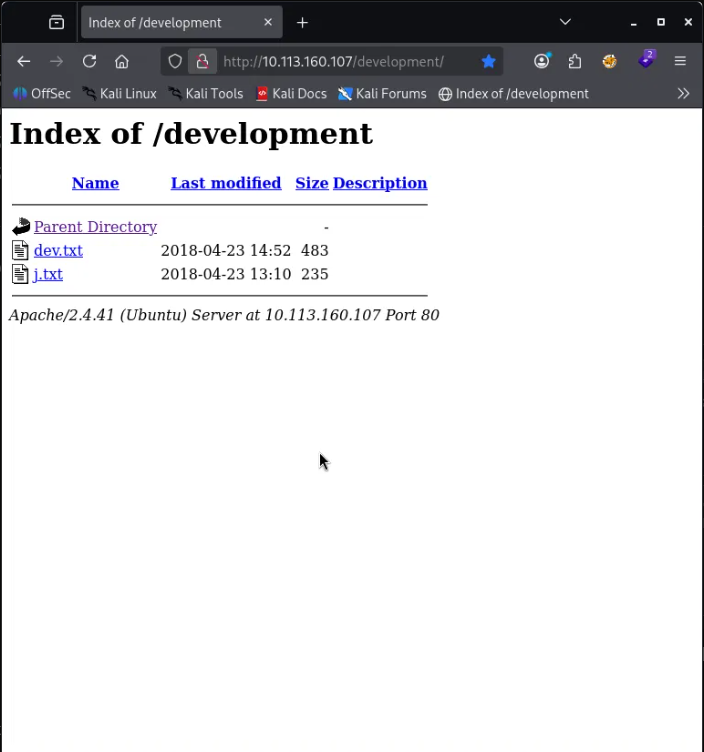

Two text files are listed: `dev.txt` and `j.txt`.

**Contents of `dev.txt`:**

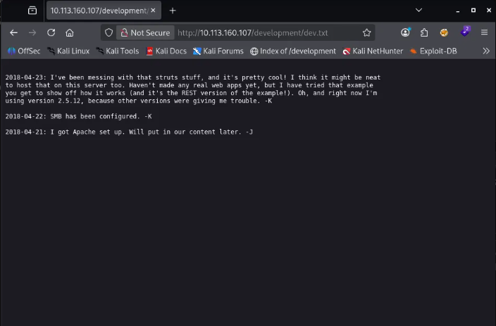

The file reveals that the server runs Apache Struts 2.5.12 (an old and potentially vulnerable version) and that SMB has been configured. Signed by `-K`.

**Contents of `j.txt`:**

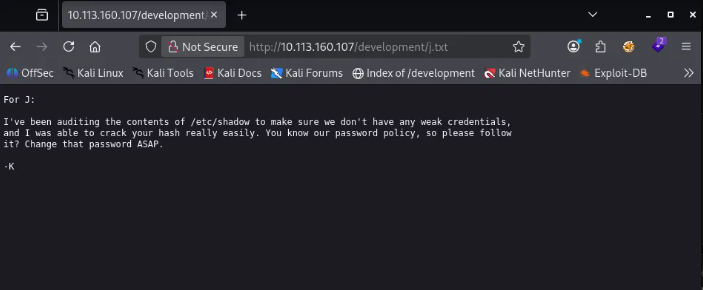

K tells J that their password in `/etc/shadow` was weak and easily cracked. This hints at a user whose name starts with `j` and has a weak password.

---

### 3. SMB Enumeration — enum4linux

SMB is active. I enumerate it to find users and shares.

```bash
enum4linux 10.113.160.107 | tee enum4linux.log
```

Full output: [enum4linux HTML report](https://htmlpreview.github.io/?https://github.com/dancpod/CTF-Diary/blob/main/TryHackMe/Resources/easy-web-basic-pentesting-enum4linux.html)

Key findings:
- Local users: **kay**, **jan**, **ubuntu**
- Anonymously accessible share: **Anonymous**

I connect to the Anonymous share:

```bash
smbclient //10.113.160.107/Anonymous
```

Inside I find `staff.txt`. I download it with `get staff.txt` and read it: Kay warns Jan not to upload personal files to the server. This confirms that `jan` is the user with the weak password mentioned in `j.txt`.

---

### 4. Exploitation — SSH bruteforce with hydra

I have a username (`jan`) and know the password is weak. I run hydra against SSH using rockyou.txt.

```bash
hydra -l jan -P /usr/share/wordlists/rockyou.txt ssh://10.113.160.107
```

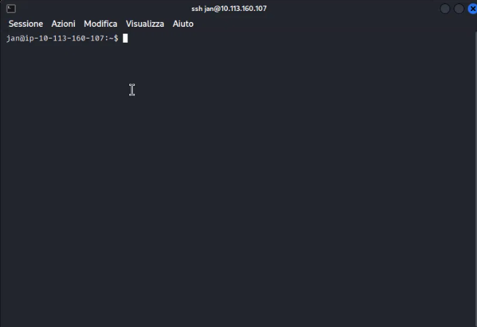

Hydra finds valid credentials: `jan:armando`.

---

### 5. Post-Exploitation — local enumeration

I log in via SSH as jan.

```bash
ssh jan@10.113.160.107
```

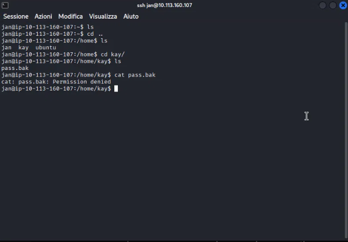

I explore the filesystem. In `/home` I find three directories: `jan`, `kay`, `ubuntu`. Inside `/home/kay` there is a `pass.bak` file, but I get permission denied when trying to read it.

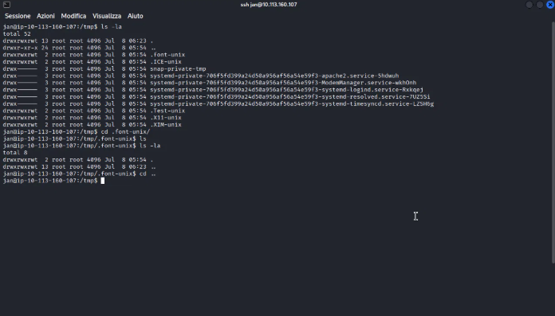

I run `ls -la /home/kay` to see all files including hidden ones.

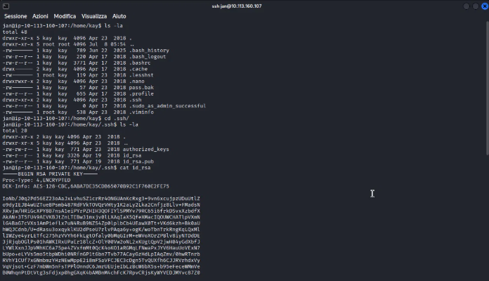

Two things stand out:
1. `/home/kay/.ssh/id_rsa` — kay's private SSH key, readable by jan due to misconfigured permissions
2. `.sudo_as_admin_successful` — kay has used sudo before

I read the private key:

```bash
cat /home/kay/.ssh/id_rsa
```

The key is encrypted with a passphrase. I copy it to my local machine.

---

### 6. Privilege Escalation — passphrase cracking

I convert the key into a format John the Ripper can crack:

```bash
ssh2john private_key_id.txt > hash.txt
john --wordlist=/usr/share/wordlists/rockyou.txt hash.txt
```

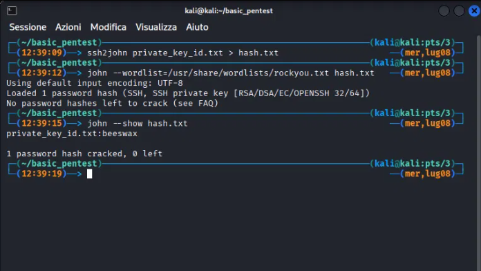

John cracks the passphrase: **beeswax**.

---

### 7. Full Access as kay

I set the correct permissions on the key file and log in as kay:

```bash
chmod 600 id_rsa.txt
ssh -i id_rsa.txt kay@10.113.160.107
```

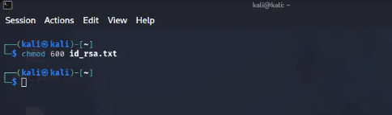

I read the `pass.bak` file:

```bash
cat pass.bak
```

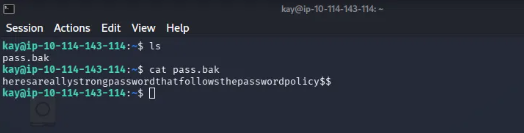

Final password: `heresareallystrongpasswordthatfollowsthepasswordpolicy$$`

---

## Lessons Learned

- **SMB leaks information**: even without credentials, an anonymous share can reveal usernames and password hints.
- **File permissions matter**: kay's private key was readable by other users. With proper `chmod 600`, this attack path would have been blocked.
- **Weak passwords are the most common vector**: jan's password was in rockyou.txt. A strong password would have stopped the bruteforce entirely.
- **The kill chain**: reconnaissance → external enumeration → exploitation → local enumeration → privilege escalation. Each phase opens the door to the next.
