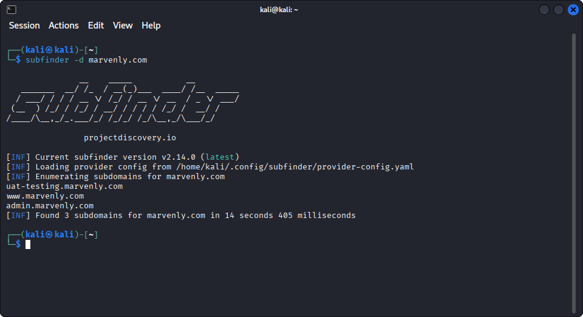
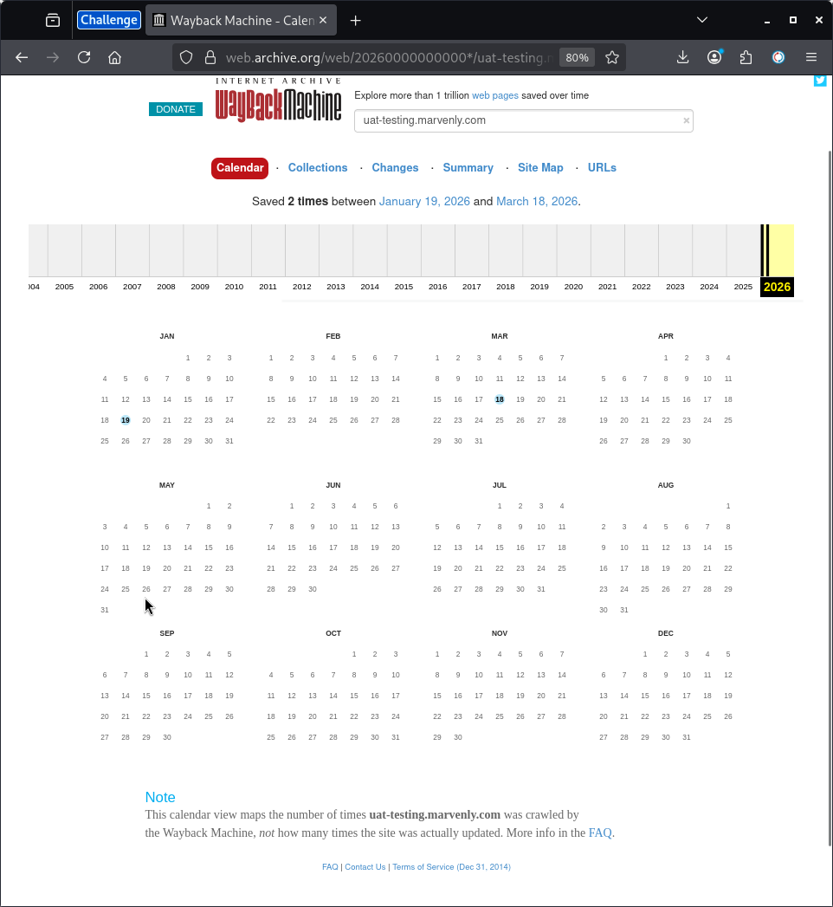
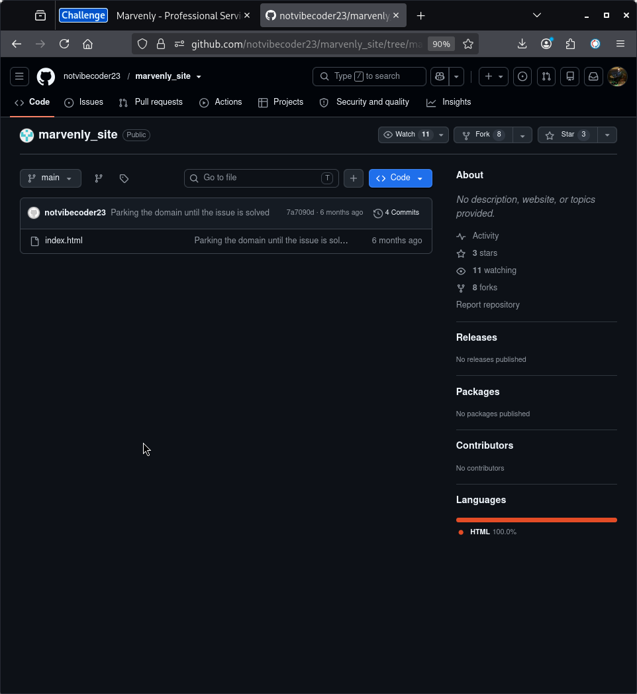
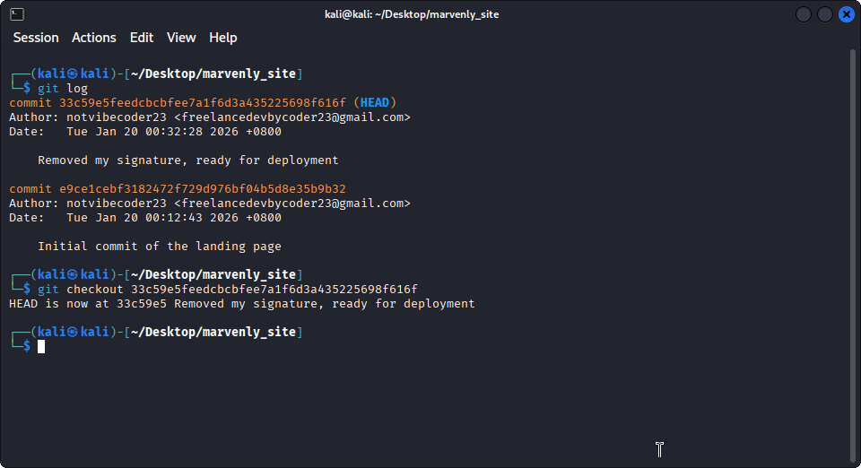
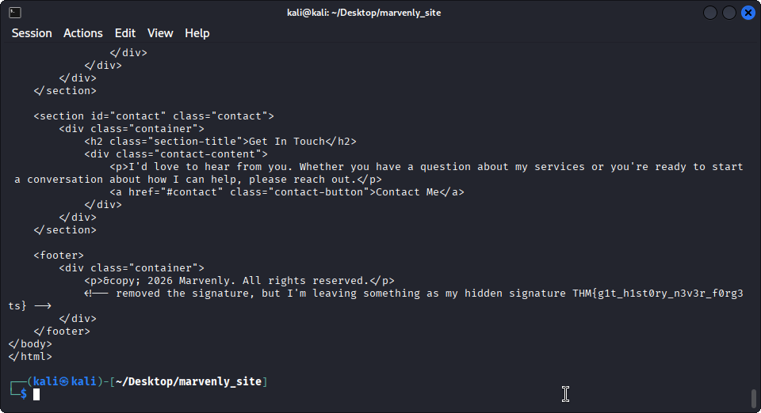

# Dev Diaries — TryHackMe

| Field       | Info                                                                 |
|-------------|----------------------------------------------------------------------|
| Platform    | [https://tryhackme.com/room/devdiaries](https://tryhackme.com/room/devdiaries)          |
| Difficulty  | Easy                                                                 |
| Category    | Web                                                                  |
| Date        | 13/07/2026                                                           |
| Time spent  | ~35 minutes                                                          |

## Challenge Description
In this challenge, the only starting point is a domain — and it's offline. The goal is to dig through whatever traces remain online to uncover information about the developer.

## Process
I used the subfinder to find any subdomains that are related to marvenly.com .  I found uat-testing.marvenly.com.

To investigate more about it I took a deeper look about some web pages that record all pages about Internet. So I took one tool to help me in this process. I used the tool called Wayback Machine

The Wayback Machine had one snapshot of uat-testing.marvenly.com. I opened it and explored the page. At the bottom, I found a footer with the developer's signature: `notvibecoder23`.

I did some research about the developer and I found the GitHub pages where is stored in a repo all the site. So i cloned it

I did the clone of the repo on GitHub, I used the `git log` command to see all commit. I saw one commit with the description "Removed my signature, ready for deployment". I did the `git checkout <commit hash>` to switch to that version of the code and inspect the HTML.

The final part was inspect the HTML code. In the end of the file we could see the flag: `THM{g1t_h1st0ry_n3v3r_f0rg3ts}`

## Lessons Learned
* The web is always scanned by sites like Wayback Machine to track down all sites
* The .git folder should never be exposed on a public web server — if it is, anyone can download the full commit history and recover deleted code.
